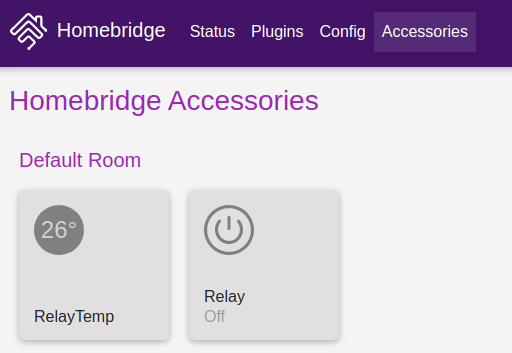
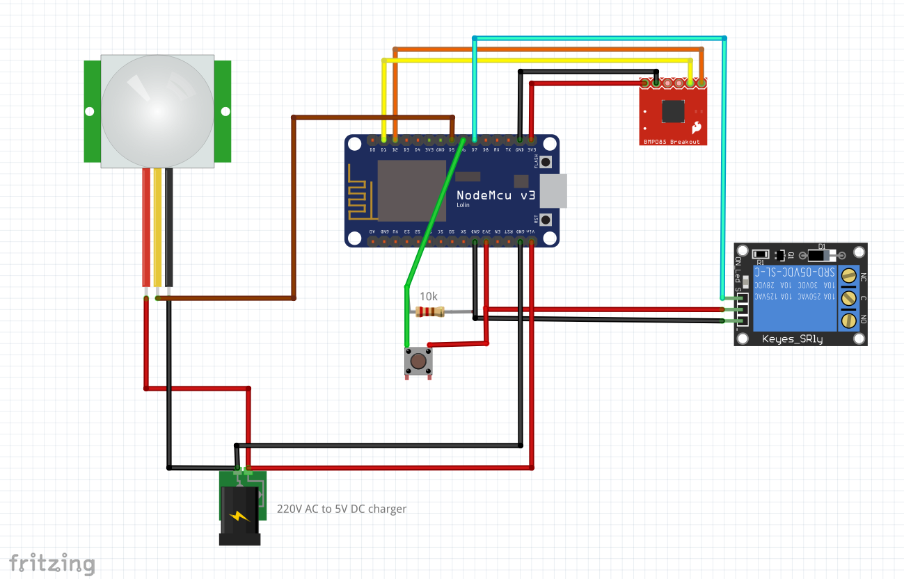
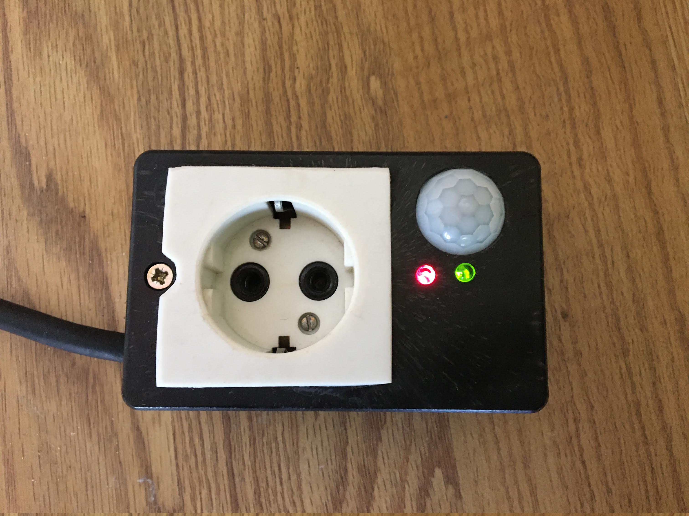
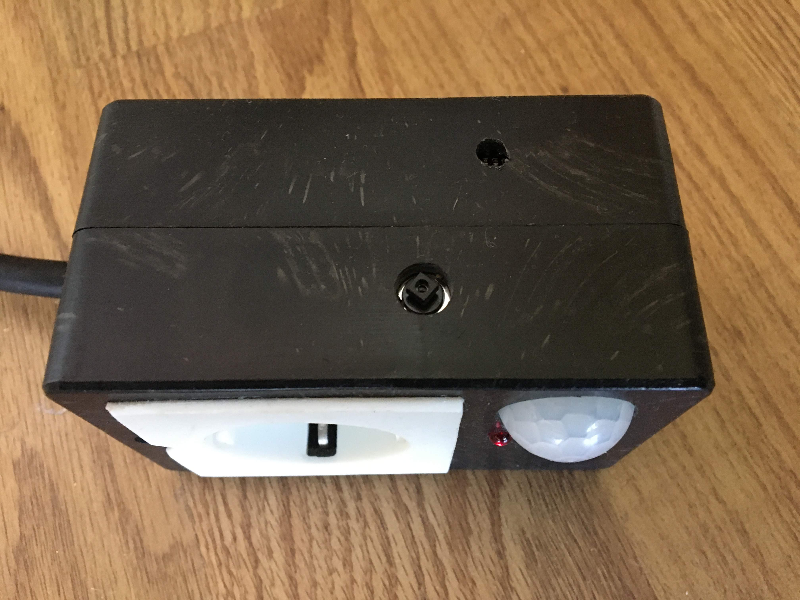

# nodemcu_relay_bmp280_motion_sensor

## Homekit using homebridge

## Components

* [Nodemcu(esp8266)](https://www.aliexpress.com/item/32665100123.html?spm=a2g0o.productlist.0.0.42776da0ida6XS&algo_pvid=8e9df5dc-7034-4056-88be-44a6ae82861a&algo_expid=8e9df5dc-7034-4056-88be-44a6ae82861a-0&btsid=0ab50f0815886721876876938e7633&ws_ab_test=searchweb0_0,searchweb201602_,searchweb201603_)
* [Relay module](https://www.aliexpress.com/item/4000002678983.html?spm=a2g0o.productlist.0.0.50f56ed9vOzn13&algo_pvid=fcfc35e4-924c-4398-994f-ad07f5d9e50f&algo_expid=fcfc35e4-924c-4398-994f-ad07f5d9e50f-2&btsid=0ab6f83915886724431258989e19dd&ws_ab_test=searchweb0_0,searchweb201602_,searchweb201603)
* [PIR module](https://www.aliexpress.com/item/4000495180305.html?spm=a2g0o.productlist.0.0.7bc04d36Z6q42O&algo_pvid=8bd45c4e-bc17-4528-a681-f258ed92be2d&algo_expid=8bd45c4e-bc17-4528-a681-f258ed92be2d-2&btsid=0ab6f83a15886724942222511e43ba&ws_ab_test=searchweb0_0,searchweb201602_,searchweb201603_)
* [BMP280 3.3v module](https://www.aliexpress.com/item/32968949182.html?spm=a2g0o.productlist.0.0.c5f572cbiMLkvo&algo_pvid=1665d2d0-4ff4-4ba5-8d8d-e5fad5c90db2&algo_expid=1665d2d0-4ff4-4ba5-8d8d-e5fad5c90db2-1&btsid=0ab6f83a15886725769125896e4388&ws_ab_test=searchweb0_0,searchweb201602_,searchweb201603_)
* 10K resistor
* push button
* broken 5v charger or any [220v to 5v module](https://www.aliexpress.com/item/32853634328.html?spm=a2g0o.productlist.0.0.770b1c57LjdNh6&algo_pvid=cb2aad54-5180-4fc3-99ee-b90d8aadf3dd&algo_expid=cb2aad54-5180-4fc3-99ee-b90d8aadf3dd-0&btsid=0ab6d69515886723154778746e6ce8&ws_ab_test=searchweb0_0,searchweb201602_,searchweb201603_)

## Circuit diagram

## Accomplished Project

